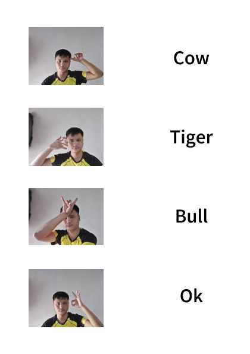

# Animal Hand Sign Detection CLI

## Overview

This project is for experimental purpose where I want to explore more features of SVM using OpenCV. It is a command-line interface (CLI) application for recognizing animal hand signs using a trained SVM classifier and Mediapipe for hand tracking. The application captures video input from a webcam, detects hand signs, and outputs the recognized animal name in real-time.

## Features

- Real-time hand sign detection using webcam.
- Utilizes an SVM classifier trained on animal hand sign data.
- Outputs the name of the recognized animal.
- Supports multiple animal signs.

## Dataset

"video_files" contains .mp4 datasets whch will be preprocessed by using open-cv and mediapipe.
Hand landmarks obtained after preprocessing are used as the input features for SVM Classifier.

## Requirements

It is recommended to use a virtual environment to manage dependencies. Follow these steps:

1. **Create a virtual environment**:
   ```bash
   python -m venv venv
   ```
2. **Activate Virtual Envioronment**
- On Windows
   ```bash
   venv\Scripts\activate
   ```
- On MacOS/Linux
    ```bash
   venv\bin\activate
   ```

3. **Install the Required Packages**

   ```bash
   pip install -r requirements.txt
   ```


## Getting Started

- Clone the Repository
   ```bash
     git clone https://github.com/MekhzZ/Animal-Hand-Sign-Detection-CLI.git
   ```

- Go to the Directory

   ```bash
     cd Animal-Hand-Sign-Detection-CLI
   ```

- Running the Application

   1. Ensure your webcam is connected and functional.
   2. Run the application using the following command:
      
   ```bash
     python main.py
   ```

## Hand-Sign Guide

   

## How I Trained the Model

                                 Video_files(tiger,cow,ok,bull)
                                             |
                                             |
                                             |
                                             +
                                    Captured_frames.py -----------------> /Captured_frames
                                             |
                                             |
                                             |
                                             +
                                        Mediapipe.py--------------------> /npy_files ----------------> Annonated_frames.py
                                                                              |                                  |
                                                                              |                                  |
                                                                              |                                  |
                                                                              +                                  +
                                                                        train_model.py                    /Annonated_frames
                                                                              |
                                                                              |
                                                                              |
                                                                              +
                                                                        /Trained_model


## Contributing

   
Contributions are welcome! If you have suggestions or improvements, feel free to create a pull request.
